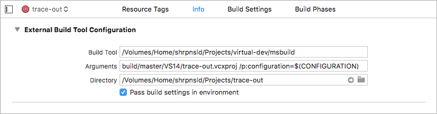
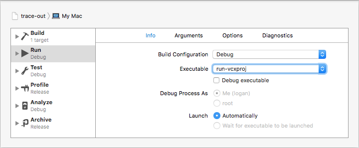
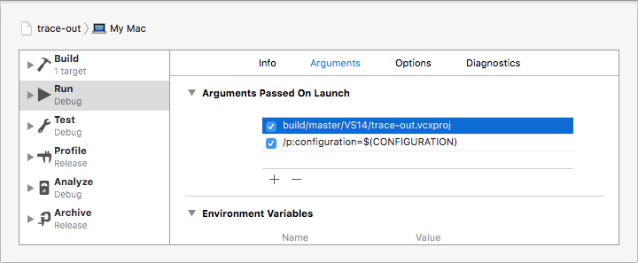
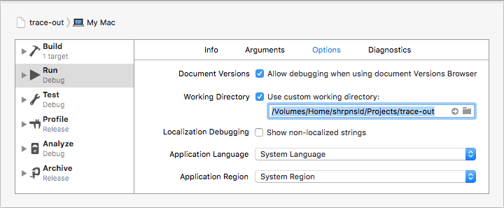

# virtual-dev

Provides MSBuild to macOS through VirtualBox, thus helps make crossplatform development easier by minimizing switching between development environments.


# Usage

```bash
$ # Get it
$ git clone https://github.com/shrpnsld/virtual-dev/
$
$ # Add shell aliases for commands to "~/.profile".
$ Path/To/virtual-dev/stuff/add-shell-aliases
$ # Otherwise use "Path/To/virtual-dev/<command>" instead of "vdev-<command>"
```
```bash
$ # Use it
$ cd /Project/Root/
$
$ # Add shared folder in guest OS for current path
$ # and initialize virtual-dev workspace
$ vdev-init GuestMachineName Username password123
$
$ # Call MSBuild to build project
$ vdev-msbuild Path/To/Project.vcxproj /p:configuration=Debug
$
$ # Run project
$ vdev-run-vcxproj Path/To/Project.vcxproj /p:configuration=Debug
```

All project-related files should be inside `Project/Root/`, so they can be accessible on guest machine.

virtual-dev workspace files are stored in `Project/Root/.vdev/` folder.


### Requires

* Host macOS *(may also work with host Linux, who knows)*
* bash 3.2 or later
* VirtualBox 5.x
* Guest Windows 7 or later with guest additions installed
* Microsoft Visual Studio 10 or later


# Using with Xcode


### Build

Add "External Build System" target and use following settings for it:

* Build Tool: `/Absolute/Path/To/virtual-dev/msbuild`
* Arguments: `<arguments to vdev-msbuild>`
* Directory: `/Absolute/Project/Root/`



### Run

Edit target scheme using following settings:

* Executable: `/Absolute/Path/To/virtual-dev/msbuild`
* "Debug executable" option should be turned off



* Arguments: `<arguments to vdev-run-vcxproj>`



* Working Directory: `/Absolute/Project/Root/`



virtual-dev converts Microsoft Visual Studio errors to GCC error format, thus Xcode will highlight compilation errors in source files.


# Notes

Adding or removing shared folder for virtual machine may change disk letter for other shared folders on that machine. This happens because  mounting order does not depend to adding/removing order. virtual-dev will detect disk change for workspace and show appropriate warning message, but only once.

virtual-dev catches `SIGINT` and kills processes that have same name with the one that was started by the script. *(It's hard to detect the exact process that was started by the script, but in most cases current implementation will not cause any issues, as long as the process name will be unique)*