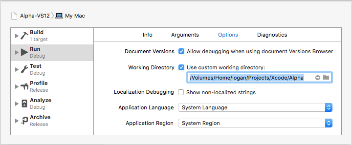

# virtual-dev

This project allows developing for Windows with native development tools in OS X environment.
Those who develop crosspalform projects might cosider this tool, as it minimizes switching between development environments.

Requires VirtualBox with guest additions, installed Windows and Visual Studio.


# Usage

```bash
$ git clone https://github.com/shrpnsld/virtual-dev/ # Can be cloned anywhere
$ cd Project/Root/
$ Path/To/virtual-dev/init VMName Username password123 Paths/To/Solutions.sln... # Set up
$ Path/To/virtual-dev/build Path/To/Solution.sln Project Debug # Build project
$ Path/To/virtual-dev/run Path/To/Solution.sln Project Debug # Run project
```

`init` will add shared folder using the solution name and `Project/Root/`, start the virtual machine and wait for user to login, then it will get and generate all configuration it needs.


# Using with Xcode

Projects in the Visual Studio solution correspond to Xcode targets. Thus to build specific Visual Studio project an external build system target should be set up in the Xcode project.

This target should have following settings:
* Build Tool: `/Absolute/Path/To/virtual-dev/build`
* Arguments: `Path/To/Solution.sln` `Project` `$(CONFIGURATION)`
* Directory: `/Absolute/Project/Root/`


To run target it's scheme should have following settings:
* Executable: `/Absolute/Path/To/virtual-dev/run`
* Option 'Debug executable' should be turned off


* Arguments: `/Absolute/Path/To/virtual-dev/`, `$(TARGETNAME)` and `$(CONFIGURATION)`


* Working Directory: `/Absolute/Project/Root/`




# Notes

* All project-related files (.sln, .vcxproj, sources) and 'OutDir' variable path should be inside `Project/Root/`, so it be accessible from guest machine, as `Project/Root/` is mounted as shared folder.

* virtual-dev reads .sln file and .vcxproj files, creates temporary files in solution folder to get information it needs for build/run. This process doesn't affect any files virtual-dev doesn't own; all the temporary files are deleted before the script exit.

* If solution or project files change, scripts will regenerate all infomation they require.

